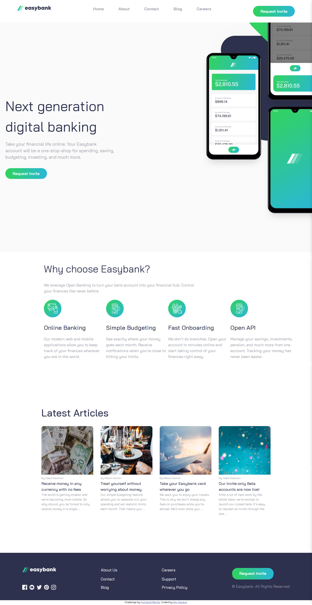

# Frontend Mentor - Easybank landing page solution

## Table of contents

- [Overview](#overview)
  - [The challenge](#the-challenge)
  - [Screenshot](#screenshot)
  - [Links](#links)
- [My process](#my-process)
  - [Built with](#built-with)
  - [What I learned](#what-i-learned)
  - [Continued development](#continued-development)
  - [Useful resources](#useful-resources)
- [Author](#author)
- [Acknowledgments](#acknowledgments)

## Overview

### The challenge

Users should be able to:

- View the optimal layout for the site depending on their device's screen size
- See hover states for all interactive elements on the page

### Screenshot



### Links

- Solution URL: [Github](https://github.com/EAguayodev/easybank-landing-page)
- Live Site URL: [Vercel](https://easybank-landing-page-mu-one.vercel.app/)

## My process

I started by structuring the HTML using semantic elements: a <header> containing the main navigation, followed by three <section> elements for the body content, and a <footer> to wrap up the layout. I used CSS with a combination of Flexbox and Grid to style the page and ensure it was fully responsive across mobile and desktop views. For interactivity, I wrote vanilla JavaScript to handle the mobile menu functionality, including toggling the navigation and animating the hamburger icon into an "X" when clicked.

### Built with

- Semantic HTML5 markup
- CSS custom properties
- Flexbox
- CSS Grid
- Vanilla JavaScript
- Desktop-first workflow

### What I learned

Through this project, I learned how to effectively combine both Flexbox and CSS Grid to build a responsive layout that adapts across screen sizes. I also wrote 7 lines of JavaScript to toggle the mobile navigation menu, allowing it to display and close when clicked. Additionally, I learned how to animate the hamburger menu icon into an "X" when the user interacts with it, improving the overall user experience on smaller devices.

To see how you can add code snippets, see below:

```html
  <button class="ham" id="hamburger">
    <span class="bar top"></span>
    <span class="bar middle"></span>
    <span class="bar bottom"></span>
  </button>
```
```css
.top,
  .middle,
  .bottom {
    height: 5px;
    width: 35px;
    background-color: #000;
    transition: 0.4s;
    margin: 3px 0;
  }
```
```js
const hamburger = document.getElementById('hamburger');
const navMenu = document.getElementById("nav-menu");

hamburger.addEventListener('click', function(){
    hamburger.classList.toggle('show');
    navMenu.classList.toggle('show');
})
```

### Continued development
For continued development, I'll be diving deeper into JavaScript by learning how to interact with APIs. This will help me build more dynamic and data-driven web projects.

### Useful resources

- [w3schools](https://www.w3schools.com/howto/howto_css_menu_icon.asp) - For the hamburger menu animation, I referred to W3Schools documentation to understand how to transform the icon into an "X" using CSS transitions and rotations.
- [Mozilla](https://developer.mozilla.org/en-US/docs/Web/CSS/background-position) - I also used Mozilla’s CSS documentation to get a better grasp of how background-position works, which helped me place the background image accurately in the design across different screen sizes.


## Author

- Frontend Mentor - [@EAguayodev](https://www.frontendmentor.io/profile/EAguayodev)

## Acknowledgments

